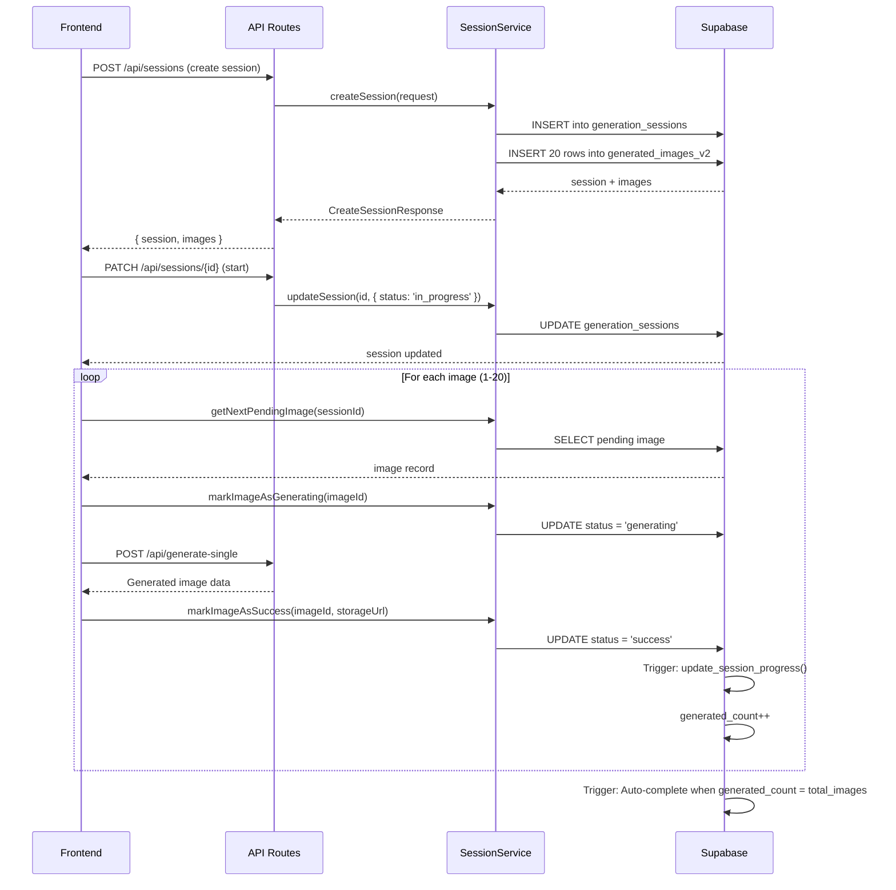
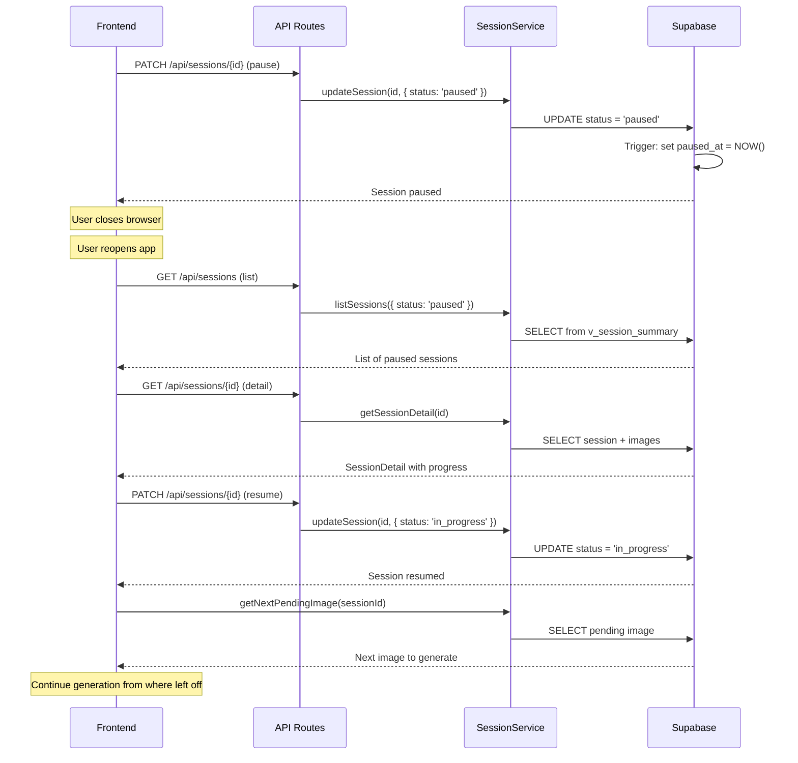

# Generation Sessions System - Architecture Design

## Overview

A conversation-based generation history system that persists image generation sessions across page refreshes, allowing users to view past conversations, pause/resume generation, and track progress.

## Database Schema

### Tables

#### 1. `generation_sessions`

Main table for tracking generation sessions (conversations).

```sql
CREATE TABLE generation_sessions (
    id UUID PRIMARY KEY,

    -- Session Metadata
    creative_name TEXT NOT NULL,           -- ABCD naming: YYYYMMDD_A1_A2_B_C_D
    description TEXT,                      -- Optional user description

    -- ABCD Configuration
    abcd_selection JSONB NOT NULL,         -- {A1, A2, B, C, D}

    -- Generation Parameters
    prompt TEXT NOT NULL,                  -- Gemini-generated Flux prompt
    product_state TEXT NOT NULL,           -- 'FOLDED' or 'UNFOLDED'
    reference_image_url TEXT NOT NULL,     -- Base reference image URL

    -- Session Status & Progress
    status session_status DEFAULT 'draft', -- draft, in_progress, paused, completed, cancelled, failed
    total_images INTEGER DEFAULT 20,       -- Target count (usually 20)
    generated_count INTEGER DEFAULT 0,     -- Successfully generated count
    failed_count INTEGER DEFAULT 0,        -- Failed generation count

    -- Generation Settings
    strength DECIMAL(3,2) DEFAULT 0.75,    -- Img2Img strength (0.0-1.0)
    seed INTEGER,                          -- Optional seed for reproducibility

    -- Error Tracking
    error_message TEXT,                    -- Last error message
    retry_count INTEGER DEFAULT 0,         -- Number of retries

    -- Timestamps
    created_at TIMESTAMPTZ DEFAULT NOW(),
    updated_at TIMESTAMPTZ DEFAULT NOW(),
    started_at TIMESTAMPTZ,                -- When generation first started
    completed_at TIMESTAMPTZ,              -- When fully completed
    paused_at TIMESTAMPTZ                  -- When last paused
);
```

**Indexes:**
- `idx_sessions_status` - Filter by status
- `idx_sessions_user` - Filter by user (future auth)
- `idx_sessions_name` - Search by creative name
- `idx_sessions_abcd` - JSON index on ABCD selection

#### 2. `generated_images_v2`

Individual images within a session.

```sql
CREATE TABLE generated_images_v2 (
    id UUID PRIMARY KEY,

    -- Session Relationship
    session_id UUID NOT NULL REFERENCES generation_sessions(id) ON DELETE CASCADE,

    -- Image Index (1-based: 1, 2, 3, ..., 20)
    image_index INTEGER NOT NULL,

    -- Storage URLs
    storage_url TEXT,                      -- Supabase Storage public URL
    storage_path TEXT,                     -- Storage path: generated/{creativeName}/{01-20}.png

    -- Image Metadata
    file_size INTEGER,                     -- Size in bytes
    width INTEGER,                         -- Image width
    height INTEGER,                        -- Image height
    mime_type TEXT DEFAULT 'image/png',    -- MIME type

    -- Generation Status
    status image_generation_status,        -- pending, generating, success, failed, cancelled
    error_message TEXT,                    -- Specific error for this image
    retry_count INTEGER DEFAULT 0,         -- Retry count for this image

    -- Generation Details
    actual_prompt TEXT,                    -- Actual prompt used (may include variations)
    generation_params JSONB,               -- API parameters (strength, seed, etc.)
    generation_duration_ms INTEGER,        -- How long generation took

    -- AI Provider Info
    provider TEXT DEFAULT 'gemini',        -- 'gemini', 'flux', etc.
    model_version TEXT,                    -- e.g., 'gemini-2.0-flash-exp'

    -- Timestamps
    created_at TIMESTAMPTZ DEFAULT NOW(),
    updated_at TIMESTAMPTZ DEFAULT NOW(),
    generated_at TIMESTAMPTZ               -- When successfully generated
);
```

**Indexes:**
- `idx_gen_images_session` - Filter by session
- `idx_gen_images_status` - Filter by status
- `idx_gen_images_session_index` - UNIQUE (session_id, image_index)

### Enums

```sql
CREATE TYPE session_status AS ENUM (
    'draft',           -- Session created, not started
    'in_progress',     -- Generation in progress
    'paused',          -- User paused generation
    'completed',       -- All images generated
    'cancelled',       -- User cancelled
    'failed'           -- Generation failed
);

CREATE TYPE image_generation_status AS ENUM (
    'pending',         -- Queued for generation
    'generating',      -- Currently being generated
    'success',         -- Successfully generated
    'failed',          -- Generation failed
    'cancelled'        -- Cancelled by user
);
```

### Triggers & Functions

1. **`update_session_progress()`**
   - Automatically updates `generated_count` and `failed_count` when images change status
   - Auto-completes session when all images are done
   - Auto-fails session if >50% images failed

2. **`set_session_started_at()`**
   - Sets `started_at` timestamp when status changes to `in_progress`

3. **`set_session_paused_at()`**
   - Sets `paused_at` timestamp when status changes to `paused`

4. **Helper Functions:**
   - `create_session_images(session_id, total_images)` - Creates image placeholder records
   - `get_next_pending_image(session_id)` - Returns next pending image for generation

### Views

#### `v_session_summary`

Enriched session data with calculated fields:

```sql
CREATE VIEW v_session_summary AS
SELECT
    s.*,
    -- Calculated fields
    ROUND((s.generated_count::DECIMAL / s.total_images * 100), 2) AS progress_percentage,
    -- Image counts by status
    (SELECT COUNT(*) FROM generated_images_v2 WHERE session_id = s.id AND status = 'pending') AS pending_count,
    (SELECT COUNT(*) FROM generated_images_v2 WHERE session_id = s.id AND status = 'generating') AS generating_count,
    (SELECT COUNT(*) FROM generated_images_v2 WHERE session_id = s.id AND status = 'success') AS success_count,
    (SELECT COUNT(*) FROM generated_images_v2 WHERE session_id = s.id AND status = 'failed') AS failed_count_actual,
    -- Latest image
    (SELECT storage_url FROM generated_images_v2 WHERE session_id = s.id AND status = 'success' ORDER BY image_index DESC LIMIT 1) AS latest_image_url,
    -- Duration
    CASE
        WHEN s.completed_at IS NOT NULL THEN EXTRACT(EPOCH FROM (s.completed_at - s.started_at))::INTEGER
        WHEN s.started_at IS NOT NULL THEN EXTRACT(EPOCH FROM (NOW() - s.started_at))::INTEGER
        ELSE NULL
    END AS duration_seconds
FROM generation_sessions s;
```

### RLS Policies

For now, all tables have **public access** (no authentication):

```sql
-- Public can view, create, update, delete all sessions
CREATE POLICY "Public can view all sessions" ON generation_sessions FOR SELECT USING (true);
CREATE POLICY "Public can create sessions" ON generation_sessions FOR INSERT WITH CHECK (true);
CREATE POLICY "Public can update sessions" ON generation_sessions FOR UPDATE USING (true);
CREATE POLICY "Public can delete sessions" ON generation_sessions FOR DELETE USING (true);

-- Same for generated_images_v2
```

**Future Enhancement:** Replace with user-based policies when authentication is added:

```sql
-- Example for authenticated users
CREATE POLICY "Users can view own sessions"
    ON generation_sessions FOR SELECT
    USING (auth.uid() = created_by);
```

## TypeScript Types

### Core Types

**File:** `/lib/types/session.ts`

```typescript
export type SessionStatus = 'draft' | 'in_progress' | 'paused' | 'completed' | 'cancelled' | 'failed';
export type ImageGenerationStatus = 'pending' | 'generating' | 'success' | 'failed' | 'cancelled';

export interface GenerationSession {
  id: string;
  creative_name: string;
  description?: string;
  abcd_selection: {
    A1: string;
    A2: string;
    B: string;
    C: string;
    D: string;
  };
  prompt: string;
  product_state: 'FOLDED' | 'UNFOLDED';
  reference_image_url: string;
  status: SessionStatus;
  total_images: number;
  generated_count: number;
  failed_count: number;
  strength: number;
  seed?: number;
  error_message?: string;
  retry_count: number;
  created_at: string;
  updated_at: string;
  started_at?: string;
  completed_at?: string;
  paused_at?: string;
}

export interface GeneratedImage {
  id: string;
  session_id: string;
  image_index: number;
  storage_url?: string;
  storage_path?: string;
  file_size?: number;
  width?: number;
  height?: number;
  mime_type: string;
  status: ImageGenerationStatus;
  error_message?: string;
  retry_count: number;
  actual_prompt?: string;
  generation_params?: Record<string, any>;
  generation_duration_ms?: number;
  provider: string;
  model_version?: string;
  created_at: string;
  updated_at: string;
  generated_at?: string;
}

export interface SessionSummary extends GenerationSession {
  progress_percentage: number;
  pending_count: number;
  generating_count: number;
  success_count: number;
  failed_count_actual: number;
  latest_image_url?: string;
  duration_seconds?: number;
}

export interface SessionDetail extends SessionSummary {
  images: GeneratedImage[];
}
```

### API Request/Response Types

```typescript
export interface CreateSessionRequest {
  creative_name: string;
  description?: string;
  abcd_selection: { A1: string; A2: string; B: string; C: string; D: string };
  prompt: string;
  product_state: 'FOLDED' | 'UNFOLDED';
  reference_image_url: string;
  total_images?: number;      // Default: 20
  strength?: number;          // Default: 0.75
  seed?: number;
}

export interface CreateSessionResponse {
  session: GenerationSession;
  images: GeneratedImage[];
}

export interface UpdateSessionRequest {
  status?: SessionStatus;
  description?: string;
  error_message?: string;
}

export interface ListSessionsQuery {
  status?: SessionStatus;
  limit?: number;             // Default: 50, Max: 100
  offset?: number;            // Default: 0
  sort_by?: 'created_at' | 'updated_at' | 'started_at';
  sort_order?: 'asc' | 'desc';
  search?: string;            // Search by creative_name
}

export interface ListSessionsResponse {
  sessions: SessionSummary[];
  total: number;
  limit: number;
  offset: number;
}
```

## Service Layer

**File:** `/lib/services/session-service.ts`

### Session CRUD

```typescript
// Create a new session (also creates image placeholder records)
createSession(request: CreateSessionRequest): Promise<CreateSessionResponse>

// Get session by ID (with summary data)
getSession(sessionId: string): Promise<SessionSummary>

// Get session detail (with all images)
getSessionDetail(sessionId: string): Promise<SessionDetail>

// List sessions with filtering and pagination
listSessions(query?: ListSessionsQuery): Promise<ListSessionsResponse>

// Update session status or metadata
updateSession(sessionId: string, updates: UpdateSessionRequest): Promise<GenerationSession>

// Delete session (cascade deletes images)
deleteSession(sessionId: string): Promise<void>
```

### Session State Management

```typescript
// Start generation
startGeneration(sessionId: string): Promise<GenerationSession>

// Pause generation
pauseGeneration(sessionId: string): Promise<GenerationSession>

// Resume paused generation
resumeGeneration(sessionId: string): Promise<GenerationSession>

// Cancel generation (cancels all pending/generating images)
cancelGeneration(sessionId: string): Promise<GenerationSession>

// Mark as completed
completeSession(sessionId: string): Promise<GenerationSession>
```

### Image Operations

```typescript
// Get next pending image for generation
getNextPendingImage(sessionId: string): Promise<GeneratedImage | null>

// Update image status and metadata
updateImage(imageId: string, updates: Partial<GeneratedImage>): Promise<GeneratedImage>

// Mark image as generating
markImageAsGenerating(imageId: string): Promise<GeneratedImage>

// Mark image as success
markImageAsSuccess(
  imageId: string,
  storageUrl: string,
  storagePath: string,
  metadata?: Partial<GeneratedImage>
): Promise<GeneratedImage>

// Mark image as failed
markImageAsFailed(imageId: string, errorMessage: string): Promise<GeneratedImage>
```

### Utilities

```typescript
// Get session statistics (total, by status)
getSessionStatistics(): Promise<Record<SessionStatus, number>>

// Check if session can be resumed
canResumeSession(sessionId: string): Promise<boolean>

// Get session progress percentage
getSessionProgress(sessionId: string): Promise<number>
```

## API Routes

### 1. `POST /api/sessions`

**Create a new session**

**Request:**
```typescript
{
  creative_name: "20251206_O_PAR_USI_JOY_CU",
  description: "Outdoor park scene with joyful emotion",
  abcd_selection: {
    A1: "Outdoor",
    A2: "Park",
    B: "Using Walker",
    C: "Joy",
    D: "CU"
  },
  prompt: "A senior woman using a walker in a park...",
  product_state: "UNFOLDED",
  reference_image_url: "https://...",
  total_images: 20,
  strength: 0.75
}
```

**Response (201):**
```typescript
{
  success: true,
  data: {
    session: { /* GenerationSession */ },
    images: [ /* Array of 20 GeneratedImage placeholders */ ]
  },
  metadata: {
    timestamp: "2025-12-06T12:00:00Z"
  }
}
```

### 2. `GET /api/sessions`

**List all sessions**

**Query Parameters:**
- `status` - Filter by status (draft, in_progress, paused, completed, cancelled, failed)
- `limit` - Results per page (1-100, default: 50)
- `offset` - Pagination offset (default: 0)
- `sort_by` - Sort field (created_at, updated_at, started_at)
- `sort_order` - Sort direction (asc, desc)
- `search` - Search by creative_name

**Example:**
```
GET /api/sessions?status=in_progress&limit=20&sort_by=created_at&sort_order=desc
```

**Response (200):**
```typescript
{
  success: true,
  data: {
    sessions: [ /* Array of SessionSummary */ ],
    total: 150,
    limit: 20,
    offset: 0
  }
}
```

### 3. `GET /api/sessions/[id]`

**Get session detail with all images**

**Example:**
```
GET /api/sessions/550e8400-e29b-41d4-a716-446655440000
```

**Response (200):**
```typescript
{
  success: true,
  data: {
    /* SessionDetail with full image array */
    id: "550e8400-e29b-41d4-a716-446655440000",
    creative_name: "20251206_O_PAR_USI_JOY_CU",
    status: "in_progress",
    total_images: 20,
    generated_count: 8,
    failed_count: 0,
    progress_percentage: 40,
    images: [ /* Array of 20 GeneratedImage */ ],
    // ... other fields
  }
}
```

### 4. `PATCH /api/sessions/[id]`

**Update session status**

**Request:**
```typescript
{
  status: "paused"
}
```

**Response (200):**
```typescript
{
  success: true,
  data: { /* Updated GenerationSession */ }
}
```

### 5. `DELETE /api/sessions/[id]`

**Delete session (cascade deletes all images)**

**Response (200):**
```typescript
{
  success: true,
  data: {
    deleted: true,
    session_id: "550e8400-e29b-41d4-a716-446655440000"
  }
}
```

## Integration with Existing `/api/generate-single`

The existing `/api/generate-single` endpoint will be updated to work with sessions:

### Updated Flow:

1. **Frontend calls:** `POST /api/sessions` to create a session
2. **Backend creates:** Session + 20 image placeholder records (all `status: 'pending'`)
3. **Frontend starts generation:**
   - Updates session: `PATCH /api/sessions/{id}` with `status: 'in_progress'`
   - Gets next pending image: Service function `getNextPendingImage(sessionId)`
4. **For each image:**
   - Mark as generating: `updateImage(imageId, { status: 'generating' })`
   - Call existing `/api/generate-single` endpoint
   - On success: `markImageAsSuccess(imageId, storageUrl, storagePath)`
   - On failure: `markImageAsFailed(imageId, errorMessage)`
5. **Triggers auto-update:**
   - Database triggers update `generated_count` and `failed_count`
   - Auto-completes session when all images are done

### Updated `/api/generate-single` Response:

```typescript
{
  success: true,
  data: {
    imageUrl: "data:image/png;base64,...",    // Base64 for preview
    imageIndex: 5,
    storageUrl: "https://...",                // Supabase Storage URL
    storagePath: "generated/creativeName/05.png",
    image_id: "uuid",                         // NEW: Image record ID
    session_id: "uuid"                        // NEW: Session ID
  }
}
```

## Data Flow Example

### Creating and Running a Session



### Pausing and Resuming



## File Structure

```
/Users/tony/rolloy-creativeos/
├── supabase/
│   └── migrations/
│       └── 20251206000001_generation_sessions.sql   [CREATED]
│
├── lib/
│   ├── types/
│   │   └── session.ts                               [CREATED]
│   └── services/
│       └── session-service.ts                       [CREATED]
│
└── app/
    └── api/
        └── sessions/
            ├── route.ts                             [CREATED - POST, GET]
            └── [id]/
                └── route.ts                         [CREATED - GET, PATCH, DELETE]
```

## Migration Instructions

### 1. Apply Migration

```bash
cd /Users/tony/rolloy-creativeos

# If using Supabase CLI
supabase db push

# Or manually in Supabase Studio:
# Copy/paste content from:
# supabase/migrations/20251206000001_generation_sessions.sql
```

### 2. Verify Migration

```sql
-- Check tables exist
SELECT table_name FROM information_schema.tables
WHERE table_schema = 'public'
AND table_name IN ('generation_sessions', 'generated_images_v2');

-- Check view exists
SELECT table_name FROM information_schema.views
WHERE table_schema = 'public'
AND table_name = 'v_session_summary';

-- Test create session
INSERT INTO generation_sessions (
    creative_name,
    abcd_selection,
    prompt,
    product_state,
    reference_image_url
) VALUES (
    'TEST_20251206',
    '{"A1":"Outdoor","A2":"Park","B":"Using","C":"Joy","D":"CU"}',
    'Test prompt',
    'UNFOLDED',
    'https://example.com/test.png'
) RETURNING id;
```

### 3. Test API Endpoints

```bash
# Test create session
curl -X POST http://localhost:3000/api/sessions \
  -H "Content-Type: application/json" \
  -d '{
    "creative_name": "20251206_O_PAR_USI_JOY_CU",
    "abcd_selection": {
      "A1": "Outdoor",
      "A2": "Park",
      "B": "Using",
      "C": "Joy",
      "D": "CU"
    },
    "prompt": "Test prompt",
    "product_state": "UNFOLDED",
    "reference_image_url": "https://example.com/test.png"
  }'

# Test list sessions
curl http://localhost:3000/api/sessions

# Test get session detail
curl http://localhost:3000/api/sessions/{SESSION_ID}

# Test update session
curl -X PATCH http://localhost:3000/api/sessions/{SESSION_ID} \
  -H "Content-Type: application/json" \
  -d '{"status": "paused"}'

# Test delete session
curl -X DELETE http://localhost:3000/api/sessions/{SESSION_ID}
```

## Next Steps for Frontend Engineer

1. **Create UI Components:**
   - Session list page (history view)
   - Session detail page (conversation view)
   - Session controls (play/pause/cancel buttons)
   - Progress indicators

2. **Update Generation Flow:**
   - Before generation: Call `POST /api/sessions`
   - During generation: Update image status via service functions
   - After each image: Update UI with progress
   - On pause: Call `PATCH /api/sessions/{id}` with `status: 'paused'`

3. **Add Real-time Updates (Optional):**
   - Use Supabase Realtime subscriptions
   - Subscribe to `generation_sessions` and `generated_images_v2` changes
   - Update UI automatically when status changes

4. **Add Session Recovery:**
   - On app load: Check for `in_progress` or `paused` sessions
   - Show notification: "You have an unfinished session. Resume?"
   - Allow user to resume from last image

## Security Considerations

### Current State (No Auth)
- All sessions are public
- Anyone can view/modify/delete any session
- Suitable for single-user or trusted environments

### Future Enhancement (With Auth)
When user authentication is added:

1. **Update RLS Policies:**
```sql
-- Only view own sessions
CREATE POLICY "Users can view own sessions"
    ON generation_sessions FOR SELECT
    USING (auth.uid() = created_by);

-- Only create sessions as yourself
CREATE POLICY "Users can create sessions"
    ON generation_sessions FOR INSERT
    WITH CHECK (auth.uid() = created_by);
```

2. **Add `created_by` to API:**
```typescript
// In createSession()
const session = await supabase
  .from('generation_sessions')
  .insert({
    ...data,
    created_by: user.id  // Get from auth context
  });
```

3. **Add Admin Policies:**
```sql
-- Admins can view all sessions
CREATE POLICY "Admins can view all sessions"
    ON generation_sessions FOR SELECT
    USING ((SELECT role FROM users WHERE id = auth.uid()) = 'admin');
```

## Performance Optimization

### Indexes
All critical indexes are created in the migration:
- Session status + created_at (for filtering)
- Session user + created_at (for user queries)
- Image session + index (for image lookups)
- Full-text search on creative_name (GIN trigram index)

### Pagination
- Default limit: 50 sessions
- Maximum limit: 100 sessions
- Always use `offset` for pagination

### Caching Strategy (Future)
- Cache session summaries for 30 seconds
- Invalidate cache on status changes
- Use Redis or Next.js cache

## Error Handling

### Service Layer Errors
```typescript
try {
  await createSession(request);
} catch (error) {
  if (error instanceof SessionError) {
    // Handle session-specific errors
  } else {
    // Handle generic errors
  }
}
```

### API Error Responses
```typescript
{
  success: false,
  error: {
    code: 'SESSION_NOT_FOUND',
    message: 'Session not found: {id}',
    details: { /* additional info */ }
  }
}
```

### Error Codes
- `INVALID_REQUEST` - Bad request data
- `SESSION_NOT_FOUND` - Session doesn't exist
- `INVALID_SESSION_STATE` - Invalid state transition
- `IMAGE_GENERATION_ERROR` - Image generation failed
- `INTERNAL_ERROR` - Server error

## Monitoring & Observability

### Key Metrics to Track
1. **Session Metrics:**
   - Total sessions created
   - Completion rate (completed / total)
   - Average generation time
   - Failure rate

2. **Image Metrics:**
   - Images generated per session
   - Average generation time per image
   - Retry rate
   - Storage usage

### Database Queries for Analytics
```sql
-- Session completion rate
SELECT
    status,
    COUNT(*) as count,
    ROUND(COUNT(*) * 100.0 / SUM(COUNT(*)) OVER(), 2) as percentage
FROM generation_sessions
GROUP BY status;

-- Average generation time
SELECT
    AVG(EXTRACT(EPOCH FROM (completed_at - started_at))) as avg_seconds
FROM generation_sessions
WHERE status = 'completed';

-- Image success rate
SELECT
    status,
    COUNT(*) as count
FROM generated_images_v2
GROUP BY status;
```

## Conclusion

This architecture provides:
- **Persistence:** Sessions survive page refreshes
- **State Management:** Pause/resume capabilities
- **Progress Tracking:** Real-time progress updates
- **Scalability:** Indexed queries, pagination
- **Flexibility:** JSONB for ABCD selection
- **Safety:** Automatic triggers, cascade deletes
- **Type Safety:** Full TypeScript types
- **RESTful API:** Standard HTTP methods

The frontend engineer can now build the UI components while the backend is fully functional and ready to integrate.
